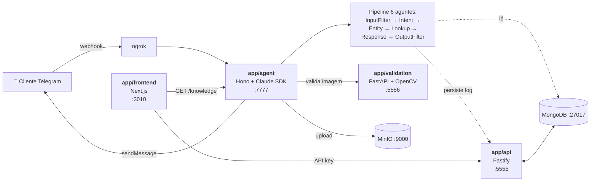

# FIAP — Faculdade de Informática e Administração Paulista

<p align="center">
  <a href="https://www.fiap.com.br/"></a>
</p>

## Integrantes do Grupo

- `RM559800` — [Jonas Felipe dos Santos Lima](https://www.linkedin.com/in/jonas-felipe-dos-santos-lima-b2346811b/)
- `RM560173` — [Gabriel Ribeiro](https://www.linkedin.com/in/ribeirogab/)
- `RM559926` — [Marcos Trazzini](https://www.linkedin.com/in/mstrazzini/)
- `RM559645` — [Edimilson Ribeiro](https://www.linkedin.com/in/edimilson-ribeiro/)

## Professor Coordenador

- [André Godoi](https://www.linkedin.com/in/profandregodoi/)

---

## YOUVISA Sprint 4 — Plataforma de Atendimento Inteligente

A Sprint 4 evolui o sistema para uma **plataforma de atendimento com pipeline multi-agente**: o NLP monolítico vira seis agentes coordenados em TypeScript usando o **Claude Agent SDK**, com classificação explícita de intent, extração de entidades, governança em camadas (input filter pré-LLM, output filter pós-LLM, guardrails no prompt), logs estruturados de toda interação, e um **portal do cliente** onde o usuário consulta o próprio processo e o histórico das interações que teve com o bot.

Toda a stack roda **100% local** via `docker compose up` — sem dependência de AWS em runtime.

### Vídeo demonstrativo

<https://youtu.be/XbzTaDDjHlg>

### Sprints anteriores

- Sprint 3 (gestão de processos com FSM): branch [`sprint/3`](https://github.com/FIAP-IA2024/youvisa/tree/sprint/3) · [Vídeo](https://youtu.be/JOql8H0fl3Q)
- Sprint 2 (MVP de atendimento com IA): branch [`sprint/2`](https://github.com/FIAP-IA2024/youvisa/tree/sprint/2) · [Vídeo](https://youtu.be/dyTIJXozWXk)

---

## Sprint 4 — Decisões de Arquitetura

Sprint 4 fez mudanças fundamentais no stack. Cada uma com rationale:

| Decisão | Por que ficou melhor |
|---|---|
| **Pipeline multi-agente em TypeScript** com Claude Agent SDK em vez de NLP monolítico (Bedrock) | Atende o briefing FIAP de "orquestração multi-agente"; cada step (intent, entity, lookup, response) é isolado, testável e visível no agent_trace. Auth via volume Docker `claude_home` (zeno-agent pattern), aproveita o plano Max — zero dependência de AWS Bedrock. |
| **Remoção do n8n** | Flows agora em código TypeScript (testáveis, versionados, code-review-able). Eliminou a dança de `__PLACEHOLDER__` substitution, removeu container EC2-pesado, simplificou docker compose. |
| **MongoDB local** (`mongo:7` container) em vez de Atlas | Verdadeiramente local — sem credencial, sem internet, sem custos. Demo reproduzível em qualquer máquina com Docker. |
| **MinIO** local em vez de AWS S3 | Mantém o contrato S3 (zero mudança no schema `Files.s3_bucket/s3_key`), todas as libs S3 funcionam normal. Migração futura para cloud é trivial. |
| **`app/classifier/` deletado** — vision agora é uma rota interna (`POST /classify`) no agent service usando Claude Vision via Anthropic Messages API | Toda IA atrás de uma única superfície (Claude Agent SDK + OAuth token), governança e logs unificados. |
| **`app/validation/` virou FastAPI** (era Lambda handler) | Roda como container long-lived, integra naturalmente no compose. OpenCV permanece (é a ferramenta certa para Laplacian variance / brilho). |
| **Notificações de status determinísticas** (templates em `app/api/src/services/status-notifier.service.ts`) — herdado da Sprint 3, agora dentro da API | Não passam por LLM nunca. Risco zero de alucinação em comunicação oficial — a governança continua sendo um princípio não-negociável da plataforma. |
| **Portal do cliente** (`/portal/[jwt]`) com auth por JWT enviado pelo bot | Atende UCD do briefing; cliente vê seu processo + histórico de interações com label de intent ao lado de cada mensagem (prova visual de que cada pergunta foi interpretada antes de respondida). |
| **Bonus: agent harness** (`context/` vault, `.claude/skills`) | Setup de desenvolvimento com IA no repo. Constituição do projeto, MOCs, learning notes, spec/plan/tasks templates — guia futuras sessões. |

---

## Arquitetura



### Componentes

| Serviço | Stack | Função |
|---|---|---|
| `app/agent` | TypeScript + Hono + `@anthropic-ai/claude-agent-sdk` | Multi-agent pipeline + Telegram webhook + classifier (Vision) + JWT |
| `app/api` | TypeScript + Fastify + Mongoose + tsyringe | Persistência (Users, Conversations, Messages, Files, Processes, InteractionLogs) + FSM com history + status notifier (templates determinísticos) |
| `app/validation` | Python 3.11 + FastAPI + OpenCV | Qualidade de imagem (blur Laplaciano, brilho, dimensões) |
| `app/frontend` | Next.js 15 + React 19 + Tailwind 4 + shadcn/ui | Console do operador (`/dashboard`) + Portal do cliente (`/portal/[jwt]`) |
| `mongo:7` | MongoDB | DB local |
| `minio/minio` | MinIO | Storage S3-compatible local |

### Pipeline multi-agente em detalhe

Cada inbound Telegram message percorre essa sequência (em `app/agent/src/orchestrator/pipeline.ts`):

1. **Handoff check** (deterministic) — se `conversation.status === 'transferred'`, silencia o bot. Preserva o contrato Sprint 2/3.
2. **Input Filter** (deterministic, regex em PT/EN) — bloqueia prompt-injection antes de qualquer chamada de LLM. Em ~5ms.
3. **Intent Classifier** (Claude Haiku 4.5) — JSON `{intent, confidence}` com 9 few-shot examples no system prompt.
4. **Entity Extractor** (Claude Haiku 4.5, paralelo com #3) — JSON com `visa_type`, `country`, `process_id`, `doc_type`, `email`, `dates`.
5. **Lookup** (deterministic, Mongo) — busca processos/files do user_id baseado no intent. Sem LLM.
6. **Response Generator** (Claude Haiku 4.5) — system prompt com 8 few-shot + 10 regras de governança (sem prazos, sem decisões, só dados reais, rótulos amigáveis, omitir `a_definir`, etc).
7. **Output Filter** (deterministic) — defesa final. Bloqueia se a resposta vazar códigos internos, prazos, ou placeholders.
8. **Logger** — persiste `InteractionLog` completo via API (com `agent_trace[]` por step).

Cenários especiais cortam o pipeline:
- `open_portal` → após Lookup, gera JWT HS256 e retorna URL. Sem Response Generator.
- `injection_attempt` → após Input Filter. Resposta determinística, intent loggado.
- `transferred` → handoff check. Silencia.

---

## Como rodar localmente

```bash
# 1. Pré-requisitos: Docker, Node 22+, ngrok, Claude Code (Max plan), bot Telegram do BotFather
# 2. Setup uma vez:
cp .env.example .env
# edite TELEGRAM_BOT_TOKEN, gere PORTAL_SECRET e DASHBOARD_SESSION_SECRET com `openssl rand -hex 32`
docker volume create claude_home
docker compose run --rm agent claude setup-token  # autoriza no browser

# 3. Sobe a stack
make up

# 4. Expõe o webhook
ngrok http 7777
make webhook URL=https://abc.ngrok-free.app

# 5. Verifica
make test       # vitest 48/48
make smoke      # E2E 8/8
```

Detalhes em [`docs/DEV_SETUP.md`](docs/DEV_SETUP.md).

### Comandos principais

| Comando | O que faz |
|---|---|
| `make up` / `make down` | Sobe / derruba a stack inteira |
| `make logs [serviço]` | Tail de logs |
| `make test` | vitest no api + agent |
| `make type-check` | tsc no api + agent |
| `make smoke` | E2E smoke (8 cenários sintéticos) |
| `make claude-setup` | `claude setup-token` no container do agent |
| `make webhook URL=...` | Registra webhook do Telegram |

---

## Estrutura do repositório

```
youvisa/
├── app/
│   ├── agent/            ← Multi-agent pipeline + Telegram webhook + classifier (Sprint 4)
│   ├── api/              ← Fastify backend
│   ├── frontend/         ← Next.js (operador + portal cliente)
│   ├── validation/       ← FastAPI + OpenCV
│   └── infrastructure/   ← Terraform (paused; deploys descontinuados na Sprint 4)
├── context/              ← Agent harness vault: constitution, specs, learnings (BONUS)
├── docs/
│   ├── DEMO_SPRINT_4.md       ← Roteiro de gravação
│   ├── DEV_SETUP.md           ← Setup do ambiente
│   ├── RELATORIO_SPRINT_4.md  ← Entregável FIAP (1-2 páginas)
│   └── diagramas/             ← .drawio + PNGs (atualizar após gravação)
├── scripts/smoke-e2e.ts  ← Smoke E2E
├── docker-compose.yml    ← 6 serviços (mongo, minio, api, agent, validation, frontend)
├── Makefile
└── .env.example
```

---

## Indicadores de Sucesso (Sprint 4 — testados E2E)

| # | Requisito do briefing FIAP | Cenário de verificação | Resultado |
|---|---|---|---|
| 1 | Multi-agent orchestration | `make smoke` STATUS_QUERY mostra trace de 6 steps | ✅ |
| 2 | Intent Classification explícita | InteractionLog tem `intent` + `intent_confidence` | ✅ |
| 3 | Entity Extraction explícita | `entities` extraídas em mensagens com visa/país/email | ✅ |
| 4 | Logs estruturados de interação | Coleção `interaction_logs` com `agent_trace[]` completo | ✅ |
| 5 | Arquitetura modular em serviços | 6 serviços no docker compose | ✅ |
| 6 | Prompt engineering com exemplos | 5–9 few-shot por agente em `prompts/*.ts` | ✅ |
| 7 | Prompt injection protection | smoke PROMPT_INJECTION bloqueia em ~5ms pré-LLM | ✅ |
| 8 | UCD interface | `/portal/[jwt]` renderizando timeline + history + docs | ✅ |

48/48 unit tests + 8/8 E2E scenarios passing na última execução. Detalhes em [`docs/RELATORIO_SPRINT_4.md`](docs/RELATORIO_SPRINT_4.md).

---

## Conformidade e Segurança

- Stack 100% local — dados não saem da máquina exceto pelas chamadas LLM (necessárias para o produto)
- JWT HS256 com TTL de 24h pra portal do cliente, scopo por `user_id`
- Authentication via `x-api-key` em toda rota da API exceto `/health`
- Defense-in-depth contra prompt injection (regex pré-LLM + governance prompt + output filter)
- Notificações de status com templates determinísticos (zero risco de alucinação)
- Tudo rastreável: cada interação tem `agent_trace[]` auditável
