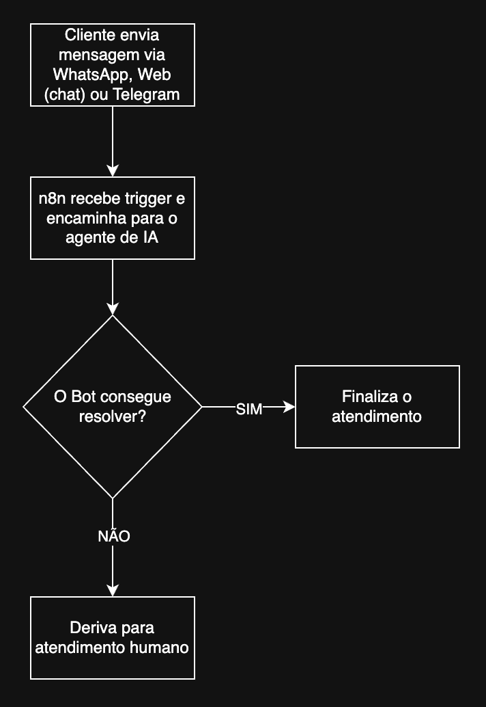

# FIAP - Faculdade de Informática e Administração Paulista

<p align="center">
<a href= "https://www.fiap.com.br/"></a>
</p>

<br>

## 👨‍🎓 Integrantes do Grupo e responsabilidades no projeto

- `RM559800` - [Jonas Felipe dos Santos Lima](https://www.linkedin.com/in/jonas-felipe-dos-santos-lima-b2346811b/) (Revisão e testes)
- `RM560173` - [Gabriel Ribeiro](https://www.linkedin.com/in/ribeirogab/) (Desenvolvimento de front-end)
- `RM559926` - [Marcos Trazzini](https://www.linkedin.com/in/mstrazzini/) (Arquitetura e Desenvolvimento de backend)
- `RM559645` - [Edimilson Ribeiro](https://www.linkedin.com/in/edimilson-ribeiro/) (Estruturas de dados)

## 👩‍🏫 Professores

### Coordenador(a)

- [André Godoi](https://www.linkedin.com/in/profandregodoi/)

## Introdução

A YOUVISA é uma empresa brasileira especializada em soluções digitais baseadas em **Inteligência Artificial, RPA e automação cognitiva** para otimizar processos consulares e de atendimento.  
O objetivo deste projeto é desenvolver uma **plataforma de atendimento multicanal inteligente**, integrando **IA conversacional, visão computacional, automação de processos (RPA), e análise de dados**, com **atendimento humano assistido** em casos complexos.

A proposta reflete uma arquitetura **modular, escalável e segura**, contemplando:

- Agente de IA conversacional omnicanal;
- Integração orquestrada por **n8n**;
- Validação de documentos via OCR e visão computacional;
- Painel de **atendimento humano (console do operador)**;
- Data pipeline e análise de dados preditiva;
- Governança, LGPD e observabilidade.

---

## Objetivos Estratégicos

| Dimensão | Objetivo                                                                                    |
|-----------|---------------------------------------------------------------------------------------------|
| **Cliente** | Garantir uma jornada fluida, natural e sem rupturas entre canais (WhatsApp, Web, Telegram). |
| **Operação** | Automatizar até 70 % das interações repetitivas, mantendo qualidade e contexto.             |
| **Negócio** | Reduzir custos operacionais e aumentar conversão de leads para clientes.                    |
| **Tecnologia** | Arquitetura baseada em nuvem e microserviços, extensível e observável.                      |

---

## Escopo Funcional

1. Atendimento conversacional com **NLP/LLM**.  
2. **Omnicanalidade via n8n** com contexto persistente.  
3. **OCR + visão computacional** para análise de documentos.  
4. **Console de operador humano**, integrado ao fluxo.  
5. **Data Lake e dashboards analíticos**.  
6. **Camadas de segurança e LGPD**.  

---

## Arquitetura Global


---

## Componentes Principais e Motivação

### Plataforma N8N

A plataforma n8n atua como o núcleo de orquestração e integração inteligente
dentro da arquitetura proposta. Ela conecta todos os canais de atendimento
(WhatsApp, Webchat, Telegram) com os componentes internos da solução — o Agente
de IA, o API Gateway, e o serviço de OCR, por meio de fluxos
automatizados, triggers e webhooks. Assim, o n8n é o responsável por garantir
que cada evento ou mensagem siga o fluxo correto: seja para uma automação de
documento, uma análise de IA, ou uma interação humana no Console do Operador.

Do ponto de vista técnico, o n8n funciona como um gateway omnicanal: centraliza
a entrada de mensagens, realiza transformações e chamadas REST para os serviços
da AWS, além de registrar logs e políticas de retry em caso de falhas. Por ser
low-code e extensível, ele permite que a YOUVISA evolua seus fluxos de negócio
rapidamente, adicionando novos canais, integrações ou automações sem reescrever
código. Cada fluxo é versionado, monitorado e audível — o que garante
rastreabilidade, segurança e governança.

Para o cliente final, os benefícios são diretos: respostas mais rápidas,
jornadas sem interrupções e uma experiência omnicanal fluida, onde ele pode
iniciar um atendimento no WhatsApp e continuar no webchat sem perder o contexto.
Para a YOUVISA, o uso do n8n reduz custos operacionais, aumenta a agilidade na
entrega de novas funcionalidades (como a adição de novos canais, futuramente) e
proporciona resiliência — já que o controle de filas, logs e reprocessamentos
ocorre de forma automática, mantendo o ecossistema sempre disponível e escalável.

---

### Agente de IA Conversacional

O Agente de IA Conversacional é o coração inteligente da solução, responsável
por interpretar a linguagem natural dos clientes e manter diálogos contínuos,
fluidos e contextuais, independentemente do canal de origem. Ele atua como o
primeiro ponto de contato cognitivo: compreende intenções, reconhece entidades
e conduz o usuário em uma jornada totalmente conversacional, sem menus rígidos
ou fluxos predefinidos. Graças à sua arquitetura modular, o agente pode
interagir diretamente com o n8n e o API Gateway, acionando automações, consultas
ou fluxos humanos conforme a necessidade.

Tecnicamente, o agente é construído sobre uma base de NLP e LLMs (com frameworks
como LangChain ou LangGraph, integrados a modelos de linguagem hospedados em
HuggingFace ou serviços equivalentes). Ele mantém uma memória contextual
persistente no MongoDB, acessada via API Gateway, garantindo que o histórico e
as preferências do usuário sejam preservados entre canais e sessões. Além disso,
utiliza RAG (Retrieval-Augmented Generation) para enriquecer suas respostas com
dados internos e documentos da YOUVISA, aumentando a precisão e a personalização
das interações. A camada semântica do agente permite compreender nuances de
linguagem e responder de forma natural, adaptando-se ao tom, idioma e contexto
de cada cliente.

O valor desse componente é duplo: para o cliente, ele proporciona uma
experiência conversacional humanizada, reduzindo o atrito e tornando o processo
de solicitação de vistos mais simples e rápido; para a YOUVISA, significa
eficiência operacional e ganho de escala, com redução de até 65% no tempo médio
de atendimento (TMA) e aumento significativo da taxa de conversão. Além disso,
o agente evolui continuamente — os logs de conversas são usados para aprimorar
o modelo, ajustando intents, respostas e fluxos, o que garante aprendizado
constante e melhoria progressiva da qualidade do atendimento.

---

### Serviço de OCR

O serviço de OCR funciona totalmente integrado ao ecossistema da AWS, e utiliza
o Amazon Textract para extração inteligente de texto, tabelas e formulários a
partir de documentos enviados pelos clientes (como passaportes, comprovantes
e formulários de visto). O fluxo inicia quando o documento é capturado pela
plataforma n8n e armazenado no Amazon S3; a partir daí, o Textract, orquestrado
por EventBridge, Lambda e SQS, processa o arquivo de forma assíncrona, extrai
os campos relevantes e aplica o Amazon Comprehend para análise semântica,
detecção de PII e validação de consistência. Os resultados estruturados são
então enviados ao API Gateway e gravados no MongoDB, onde podem ser consumidos
pelo Agente de IA ou revisados por um humano no Console do Operador, quando
necessário.

Essa arquitetura traz benefícios diretos ao cliente e à operação da YOUVISA:
acelera o processo de validação documental, elimina erros manuais, garante
conformidade com a LGPD (dados mantidos e processados exclusivamente em
território brasileiro – AWS São Paulo) e reduz drasticamente o tempo de resposta
em etapas críticas do processo de visto. A escolha da stack AWS — com Textract,
Comprehend, Lambda e S3 — fundamenta-se na alta acurácia dos modelos de IA
gerenciados, escalabilidade serverless, integração nativa com o restante da
arquitetura e baixo custo operacional, além de fornecer rastreabilidade,
segurança e resiliência corporativa sem exigir infraestrutura adicional.

---

### API Gateway

O API Gateway funciona como a espinha dorsal da arquitetura proposta,
centralizando toda a comunicação entre os componentes internos — Agente de IA,
n8n, OCR, MongoDB e Console do Operador — de forma segura, padronizada e
escalável. Ele atua como ponto central e único de entrada autorizado para as
requisições externas e internas, garantindo autenticação, autorização e controle
de tráfego. Essa camada também abstrai a complexidade técnica dos diversos
serviços que compõem o ecossistema, permitindo que cada um opere de maneira
independente, sem acoplamento direto entre si.

Em termos técnicos, o API Gateway implementa autenticação via JWT, controle de
permissões RBAC, e políticas de segurança (rate limiting, CORS, logs e
monitoramento via AWS CloudWatch). Ele também é responsável por orquestrar e
rotear chamadas REST entre os módulos da plataforma — por exemplo, entregando ao
Agente de IA os dados armazenados no banco de dados MongoDB, disparando o
pipeline do OCR, ou repassando atualizações de status ao Console do Operador em
tempo real via WebSockets. Além disso, todos os acessos a dados sensíveis (como
documentos ou informações pessoais) passam obrigatoriamente pelo gateway, o que
assegura conformidade com a LGPD e rastreabilidade completa de eventos.

Não está explícito no desenho geral da arquitetura, a fim de simplificar o
entendimento da solução, mas o API Gateway da solução é composto por diversos
componentes da nuvem AWS, começando pelo serviço de mesmo nome (AWS API Gateway),
que recebe, autentica e encaminha as requisições de API para o backend, que
inicialmente será um conjunto de lambdas (AWS Lambda) que executam funções de
processamento e integração com outros serviços da AWS utilizados pela solução.
A opção por um backend "serverless", com AWS Lambda, agrega simplicidade e
rapidez de prototipagem, enquanto a abstração criada pelo API Gateway permite
a migração futura do backend para outros serviços da AWS, como o AWS ECS
(Elastic Container Service) ou AWS Fargate, caso seja necessário.

Para o cliente final, o API Gateway garante velocidade, segurança e
confiabilidade em cada interação. Graças à sua arquitetura escalável e
monitorada, o cliente experimenta um atendimento contínuo e sem interrupções,
mesmo em períodos de alta demanda. A centralização de autenticação e logs
também permite respostas mais consistentes, maior disponibilidade e menor
latência, principalmente por optarmos utilizar a região São Paulo da AWS. Na
prática, isso significa que o cliente obtém respostas mais rápidas, com mais
precisão e privacidade assegurada — reforçando a confiança na YOUVISA como uma
empresa segura, moderna e orientada à experiência digital.

---

### Console do Operador (Front-end Interno)

O Console do Operador é o ponto de convergência entre automação e atendimento
humano dentro da arquitetura proposta. Ele funciona como uma interface única
de atendimento que permite que operadores humanos assumam casos transferidos
pelo Agente de IA de forma contínua e contextualizada, sem perda de informações
ou histórico. Quando o assistente conversacional identifica situações complexas
ou que exigem julgamento humano, o Console se torna o ambiente principal de
atuação, assegurando fluidez na jornada do cliente e mantendo a experiência
omnicanal entre WhatsApp, Web (Chat) e Telegram.

Sua estrutura oferece uma interface simples e unificada para atendimento, onde
cada operador visualiza conversas de múltiplos canais, documentos associados
e o histórico completo das interações. A distribuição de atendimentos é gerida
por uma fila inteligente, que aplica regras dinâmicas com base em idioma,
priorização segmentada por perfil do cliente (por exemplo, Bronze, Prata ou
Ouro) ou por SLA (nível de urgência com base em prazos). Além disso, o Console
conta com um painel de supervisão que exibe métricas de qualidade (QA), SLAs,
tempo médio de atendimento, NPS e índices de retrabalho, fornecendo ao gestor
visibilidade total sobre a operação e suporte à tomada de decisão baseada em
dados.

Do ponto de vista técnico, o Console incorpora autenticação baseada em usuário
e senha, controle de acesso baseado em função (RBAC) e logs de auditoria,
garantindo segurança e rastreabilidade em conformidade com a LGPD. Sua
arquitetura baseada em React e WebSockets permite atualizações em tempo real,
notificações instantâneas e um design responsivo que facilita o uso em
diferentes dispositivos. Com baixa curva de aprendizagem e layout intuitivo,
o Console reduz o tempo de onboarding e aumenta a produtividade dos atendentes,
oferecendo uma experiência fluida e eficiente.

Para a YOUVISA, o Console do Operador representa o equilíbrio ideal entre
automação e personalização. Ele assegura a continuidade real entre IA e humano,
permitindo que o operador retome conversas com o contexto completo, sem
repetições ou retrabalho. Além disso, centraliza governança e métricas
operacionais, garantindo que o crescimento da base de clientes ocorra com
qualidade, previsibilidade e empatia. Em essência, o Console é o elo que
transforma tecnologia em experiência humana — ampliando a eficiência
operacional e fortalecendo o relacionamento da YOUVISA com seus clientes.

---

### Arquitetura de Dados

Para garantir o melhor equilíbrio entre simplicidade, confiabilidade e
escalabilidade para acesso a dados na plataforma, optamos por centralizar
toda a persistência de dados transacionais e de contexto em uma base de dados
MongoDB, em conjunto com um repositório (conjunto de buckets) de documentos,
utilizando o AWS S3.

Essa arquitetura acelera o tempo de entrega e percepção de valor da solução,
enquanto ainda deixa espaço para expansão e adaptação às necessidades futuras,
com a adição de componentes especializados de caching (como o REDIS), ou um
barramento de mensagens para desacoplamento total dos componentes e criação de
um pipeline de dados, utilizando Kafka (AWS MSK), o AWS Lambda e o Amazon
EventBridge.

A fim de não tornar o entendimento da arquitetura geral muito complexo, optamos
por não incluir alguns componentes nativos da arquitetura AWS (como CodeCommit,
CloudWatch, etc), mas estes outros componentes consolidam logs, métricas de
utilização dos componentes AWS e monitoramento de integridade, fazendo parte
da arquitetura de dados.

---

### Segurança e Conformidade

Dado o cenário naturalmente sensível da solução (informações pessoais utilizadas
em um processo oficial de emissão de vistos), é importante que a solução seja
aderente às últimas tecnologias, protocolos e melhores práticas de segurança,
além de estar em conformidade com a LGPD. Para isso, utilizamos:

- Criptografia (AES-256 / TLS 1.3).  
- IAM granular, com controle de acesso RBAC.
- Logs imutáveis (WORM).  
- DLP básico para anexos.  
- Políticas LGPD: consentimento, anonimização, direito ao esquecimento.  
- Monitoramento e alertas de segurança (SIEM).

---

## Fluxo Omnicanal Integrado (Cliente ↔ IA ↔ Humano)



O diagrama acima visa apenas ilustrar uma visão alto-nível da comunicação, mas
diversos componentes da solução são acionados e trabalham de maneira integrada
para promover esse fluxo:

- Independente do canal que o cliente contacta a YOUVISA, o acionamento do fluxo
  n8n ocorre via gatilho (trigger), que é responsável por rotear as mensagens
  para o Agente IA, que interpreta a intenção e contexto da mensagem, e decide
  se o caso é resolvível pelo bot ou se precisa ser aberto como um "Case" para
  um operador humano. A grosso modo, o n8n continua atuando como um orquestrador
  do fluxo, mesmo depois que o bot (agente de IA) é acionado, garantindo flexibilidade.
- O bot utiliza NLP (Natural Language Processing) para se comunicar com o usuário,
  interpretando a intenção e contexto da mensagem, e respondendo de forma natural
  e adaptada ao tom, idioma e contexto de cada cliente.
- Em alguns casos, o cliente precisará enviar arquivos, que serão armazenados no
  S3 pelo n8n, o que dispara um evento Lambda para acionar o serviço de OCR e
  extrair as informações do arquivo (Ex: Dados do passaporte enviados a partir
  de uma foto do passaporte, ou dados de um comprovante de preenchimento de um
  formulário), e estes dados são salvos no banco de dados via API Gateway.
- Todas as mensagens trocadas, informações extraídas e arquivos enviados são
  armazenadas na arquitetura de dados da plataforma.
- Em caso de derivação para atendimento humano, é criado um novo registro de
  Case no MongoDB, e o n8n é responsável por atualizar o status do Case e
  notificar o operador humano via email ou SMS, utilizando os serviços de negócio
  da YOUVISA.

---

## Integracao Telegram + S3

Esta secao descreve a implementacao MVP do primeiro componente da arquitetura YOUVISA 360: integracao entre Telegram e AWS S3 via n8n.

### Visao Geral

A integracao Telegram + S3 e o ponto de partida da plataforma omnicanal, estabelecendo:

- Primeiro canal de comunicacao ativo (Telegram)
- Infraestrutura de armazenamento de documentos (S3)
- Base de orquestracao via n8n

Este MVP permite que usuarios enviem documentos (passaportes, comprovantes, formularios) diretamente pelo Telegram, com armazenamento automatico e organizado no S3, preparando o terreno para futuras integracoes com OCR, MongoDB e outros canais.

### Arquitetura do Componente

```
Usuario                 n8n                    AWS
(Telegram)             (Local)              (Cloud)
    |                    |                      |
    |-- Envia arquivo -->|                      |
    |                    |-- Download -->       |
    |                    |   (Telegram API)     |
    |                    |                      |
    |                    |-- Upload ----------->|
    |                    |                   [S3 Bucket]
    |                    |                   sa-east-1
    |<-- Confirmacao ----|                      |
```

### Prerequisitos

Antes de configurar a integracao, certifique-se de ter:

1. **Docker e Docker Compose** instalados

   ```bash
   docker --version
   docker-compose --version
   ```

2. **Terraform** (>= 1.5.0) instalado

   ```bash
   terraform version
   ```

3. **Conta AWS** com:
   - Acesso a regiao `sa-east-1` (Sao Paulo)
   - Permissoes para criar buckets S3 e usuarios IAM
   - AWS CLI configurado localmente

4. **Conta no Telegram** para criar o bot

### Passo 1: Configurar Bot do Telegram

1. Abra o Telegram e busque por `@BotFather`
2. Envie o comando `/newbot`
3. Siga as instrucoes para escolher:
   - **Nome do bot**: YOUVISA Assistant (exemplo)
   - **Username**: youvisa_assistant_bot (deve terminar com `_bot`)
4. Copie o **token** fornecido (formato: `123456789:ABC-DEF...`)
5. Guarde o token temporariamente (sera usado no `.env`)

Para testar, envie `/start` para o bot e verifique que esta ativo.

### Passo 2: Provisionar Infraestrutura AWS com Terraform

1. **Configure as variaveis do Terraform**:

   ```bash
   cd app/infrastructure/terraform/s3
   cp terraform.tfvars.example terraform.tfvars
   ```

2. **Edite `terraform.tfvars`** e defina um nome unico para o bucket:

   ```hcl
   s3_bucket_name = "youvisa-files-dev-SEU-SUFIXO-UNICO"
   ```

3. **Inicialize o Terraform**:

   ```bash
   terraform init
   ```

4. **Revise o plano de execucao**:

   ```bash
   terraform plan
   ```

5. **Aplique a configuracao**:

   ```bash
   terraform apply
   ```

   Digite `yes` quando solicitado.

6. **Copie as credenciais AWS** geradas:

   ```bash
   terraform output -raw aws_access_key_id
   terraform output -raw aws_secret_access_key
   terraform output -raw bucket_name
   ```

Guarde esses valores para o proximo passo.

Documentacao detalhada: [app/infrastructure/terraform/s3/README.md](app/infrastructure/terraform/s3/README.md)

### Passo 3: Configurar Variaveis de Ambiente

1. **Copie o arquivo de exemplo**:

   ```bash
   cd ../../..  # Voltar para raiz do projeto
   cp .env.example .env
   ```

2. **Edite `.env`** e preencha com os valores reais:

   ```bash
   # Token do Telegram (do BotFather)
   TELEGRAM_BOT_TOKEN=123456789:ABC-DEF1234ghIkl-zyx57W2v1u123ew11

   # Credenciais AWS (do Terraform)
   AWS_ACCESS_KEY_ID=AKIA...
   AWS_SECRET_ACCESS_KEY=...
   S3_BUCKET_NAME=youvisa-files-dev-SEU-SUFIXO

   # n8n (defina usuario e senha para acesso)
   N8N_BASIC_AUTH_USER=admin
   N8N_BASIC_AUTH_PASSWORD=sua_senha_segura_aqui
   ```

**IMPORTANTE**: Nunca commite o arquivo `.env` no Git. Ele ja esta no `.gitignore`.

### Passo 4: Iniciar n8n com Docker

1. **Inicie o container n8n**:

   ```bash
   docker-compose up -d
   ```

2. **Verifique que esta rodando**:

   ```bash
   docker-compose ps
   ```

   Saida esperada:

   ```
   NAME          STATUS    PORTS
   youvisa-n8n   Up        0.0.0.0:5678->5678/tcp
   ```

3. **Acesse a interface n8n**:
   Abra <http://localhost:5678> no navegador e faca login com as credenciais do `.env`.

### Passo 5: Importar e Configurar Workflow

1. **Dentro do n8n**, clique em "Workflows" > "Import from File"

2. **Selecione o arquivo**: `app/n8n-workflows/001-telegram-to-s3.json`

3. **Configure as credenciais**:

   **a) Telegram Bot API**:
   - Clique em qualquer node Telegram com icone de aviso
   - Selecione "Create New Credential"
   - Nome: Telegram Bot API
   - Access Token: cole o valor de `TELEGRAM_BOT_TOKEN`
   - Salve

   **b) AWS Credentials**:
   - Clique no node "Upload to S3"
   - Selecione "Create New Credential"
   - Access Key ID: `AWS_ACCESS_KEY_ID`
   - Secret Access Key: `AWS_SECRET_ACCESS_KEY`
   - Region: `sa-east-1`
   - Salve

4. **Ative o workflow**:
   - Clique no toggle no canto superior direito
   - Status deve mudar para "Active"

### Passo 6: Testar a Integracao

1. **Abra o Telegram** e encontre seu bot pelo username

2. **Envie o comando** `/start`
   - O bot deve responder (se configurado)

3. **Envie um arquivo** (qualquer documento, imagem, PDF)
   - O workflow processara o arquivo
   - Voce recebera uma mensagem de confirmacao

4. **Verifique no S3**:

   ```bash
   aws s3 ls s3://youvisa-files-dev-SEU-SUFIXO/telegram/ --recursive
   ```

   Voce deve ver o arquivo organizado por data:

   ```
   telegram/2025/11/18/12345_1731888000_documento.pdf
   ```

5. **Verifique os logs no n8n**:
   - Clique em "Executions" na barra lateral
   - Veja a execucao mais recente com status "success"

### Estrutura de Armazenamento no S3

Os arquivos sao organizados automaticamente com a seguinte estrutura:

```
s3://youvisa-files-dev/
└── telegram/
    └── YYYY/          # Ano
        └── MM/        # Mes
            └── DD/    # Dia
                └── {file_id}_{timestamp}_{nome_original}
```

**Exemplo**:

```
s3://youvisa-files-dev/telegram/2025/11/18/
├── 12345_1731888000_passaporte.pdf
├── 12346_1731888123_visto.jpg
└── 12347_1731888456_comprovante.pdf
```

**Convencao de nomenclatura**:

- `file_id`: ID unico do Telegram
- `timestamp`: Unix timestamp (milissegundos)
- `nome_original`: Nome do arquivo enviado pelo usuario

Isso garante:

- Nenhum conflito de nomes (file_id + timestamp sao unicos)
- Rastreabilidade (file_id mapeia para mensagem original no Telegram)
- Organizacao cronologica (estrutura de pastas por data)

### Troubleshooting

**Workflow nao recebe mensagens**:

- Verifique se o workflow esta ativo (toggle verde)
- Confirme o token do Telegram esta correto
- Para ambiente local, considere usar Telegram Polling mode ao inves de webhook

**Erro "Access Denied" no S3**:

- Verifique credenciais AWS no n8n
- Confirme que o bucket name no `.env` esta correto
- Revise a politica IAM do usuario (deve ter `s3:PutObject`)

**n8n nao inicia**:

- Verifique logs: `docker-compose logs -f n8n`
- Confirme que a porta 5678 nao esta em uso
- Valide variaveis de ambiente no `.env`

**Arquivo corrompido no S3**:

- Verifique que binary data esta habilitado no node S3
- Confirme que Content-Type esta sendo preservado

### Limitacoes Conhecidas (MVP)

Esta e a versao inicial (MVP). Limitacoes conhecidas:

1. **Webhook local**: n8n rodando em localhost nao recebe webhooks do Telegram. Para producao, use ngrok ou dominio publico com HTTPS.
2. **Polling alternativo**: Se webhook nao funcionar, use Telegram Polling mode (menos eficiente mas funciona localmente).
3. **Limite de 20MB**: Telegram Bot API limita arquivos a 20MB.
4. **Sem autenticacao**: Qualquer pessoa com o username do bot pode enviar arquivos (sera implementado futuramente).
5. **Sem OCR**: Arquivos sao apenas armazenados, nao processados (proxima fase).

### Proximos Passos

Com a integracao Telegram + S3 funcionando, os proximos passos incluem:

1. **Integracao com MongoDB**: Salvar metadados das mensagens e usuarios
2. **Processamento OCR**: Usar AWS Textract para extrair dados dos documentos
3. **Integracao WhatsApp**: Adicionar WhatsApp Business API como canal
4. **Agente de IA**: Implementar NLP/LLM para conversas inteligentes
5. **Console do Operador**: Interface web para atendimento humano

Para mais detalhes sobre o workflow n8n, consulte: [docs/n8n-workflows.md](docs/n8n-workflows.md)

---

## Plano de Implementação Sugerido

| Fase | Entregas | Duração |
|------|-----------|----------|
| **S1** | Setup Cloud + n8n + Infra base + RBAC | 4 sem |
| **S2** | MVP Agente IA (NLP/LLM) + WhatsApp + Context Store | 6 sem |
| **S3** | OCR + integrações API | 6 sem |
| **S4** | Console Operador + Handoff + QA | 6 sem |
| **S5** | Data Lake + Dashboards + Segurança final | 4 sem |
| **Total** | **26 semanas (~6,5 meses)** | |

---

## Indicadores de Sucesso

**IMPORTANTE**: Os indicadores a seguir foram estimados, apenas a título de exemplificar
áreas de ganho com o projeto, pois não obtivemos acesso aos indicadores reais da
empresa. De qualquer forma, é possível adaptá-los à realidade da YOUVISA.

| Métrica | Antes  | Depois | Variação |
|----------|--------|-------|-------|
| Tempo médio de atendimento | 35 min | 12 min | −65 % |
| Retrabalho documental | 18 %   | < 5 % | −72 % |
| Custo por lead | R$ 100 | R$ 65 | −R$35 |
| Conversão para cliente | 22 %   | 38 %  | +16 p.p. |
| NPS médio | 70     | 90    | +20 pts |

---

## Riscos e Mitigações

| Risco | Impacto | Mitigação |
|--------|----------|-----------|
| Erro semântico do NLP | Médio | Fallback humano + retraining contínuo |
| Falha de canal (API WA/Telegram) | Alto | Failover n8n + logs automáticos |
| Vazamento de dados | Crítico | Criptografia + IAM + DLP + auditoria |
| Resistência da equipe | Médio | Treinamento e onboarding progressivo |
| Sobrecarga de fluxos | Médio | Escalabilidade cloud (EKS/Fargate) |

A gestão de riscos é parte essencial da proposta YOUVISA 360°, assegurando
estabilidade operacional e confiança durante toda a jornada digital do cliente.
O principal desafio técnico está na precisão do processamento de linguagem
natural; erros semânticos do NLP podem gerar interpretações incorretas das
intenções do usuário. Para mitigar isso, a solução prevê um fallback humano
automático, que transfere o atendimento ao Console do Operador quando há
incerteza, aliado a um processo contínuo de retraining do modelo com base em
logs de conversas reais — garantindo evolução progressiva da IA e redução de
falhas ao longo do tempo.

Outro risco crítico é a indisponibilidade de canais de comunicação, como APIs
do WhatsApp ou Telegram. A arquitetura endereça isso com mecanismos de
failover n8n e logs automáticos, permitindo re-roteamento dinâmico para outros
canais e garantindo continuidade no atendimento. Em paralelo, o vazamento de
dados, considerado de impacto crítico, é mitigado por um conjunto de camadas
de segurança: criptografia ponta a ponta (KMS), gestão de identidades (IAM),
políticas DLP e auditorias periódicas, mantendo a conformidade com a LGPD e
preservando a reputação da YOUVISA.

No aspecto humano, a resistência da equipe à adoção de novas tecnologias é
tratada por meio de programas de treinamento e onboarding progressivo, que
enfatizam o papel complementar da automação ao trabalho humano, reforçando
a percepção de que a IA atua como suporte — e não substituição — ao operador.
Por fim, para evitar sobrecarga de fluxos e gargalos de desempenho em
momentos de alta demanda, a infraestrutura foi desenhada com escalabilidade
nativa em cloud (Serverless com Lambda, mas podendo ser expandido para
EKS/Fargate), permitindo crescimento automático de recursos sob demanda.

Essas estratégias de mitigação consolidam uma arquitetura resiliente, segura
e adaptável, capaz de equilibrar inovação tecnológica e governança
operacional. Com esse modelo, a YOUVISA garante não apenas alta
disponibilidade e integridade dos serviços, mas também uma jornada de
atendimento estável, confiável e centrada no cliente.

---

## Conclusão

A solução proposta consolida uma visão completa da transformação digital no
atendimento consular, unindo tecnologia, inteligência e experiência humana em
um ecossistema coerente e escalável. Ela combina processamento de linguagem
natural, automação e orquestração de fluxos para criar um atendimento
verdadeiramente omnicanal, no qual o cliente transita livremente entre
WhatsApp, Webchat ou Telegram, preservando sempre o contexto de sua
solicitação. Essa integração garante agilidade e consistência nas interações,
reduzindo atritos e elevando o padrão de atendimento a um novo patamar de
eficiência e personalização.

A camada de inteligência conversacional, composta por NLP e LLMs, transforma
o diálogo com o usuário em uma experiência natural e empática, substituindo
fluxos baseados em menus por interações livres e contextuais. Esse agente
cognitivo é capaz de compreender intenções, interpretar documentos e até
acionar automações — como OCR ou RPA — de forma autônoma, acelerando processos
e reduzindo o tempo médio de atendimento. Em paralelo, o n8n atua como o
maestro da solução, orquestrando canais, fluxos e integrações com rapidez e
flexibilidade, possibilitando que a YOUVISA adicione novos serviços e
conectores sem a necessidade de desenvolvimento extensivo.

O Console do Operador complementa a jornada digital ao oferecer o toque
humano quando necessário, com uma interface unificada e inteligente que dá
continuidade aos atendimentos iniciados pela IA, preservando histórico e
contexto. Essa integração entre automação e atendimento humano garante que
nenhuma interação seja perdida, mantendo qualidade, empatia e supervisão.
Além disso, o módulo de Data & Analytics transforma cada interação em dado
estratégico, permitindo que a YOUVISA antecipe demandas, otimize recursos e
tome decisões orientadas por indicadores de desempenho e satisfação.

Por fim, a arquitetura foi desenhada com segurança e conformidade como pilares
centrais, assegurando que todos os dados sejam processados e armazenados de
acordo com a LGPD em infraestrutura AWS localizada no Brasil. Com isso, a
YOUVISA posiciona-se como uma referência em IA aplicada a serviços consulares,
entregando um ecossistema digital que combina automação inteligente,
atendimento humano e governança de dados — oferecendo ao cliente uma
experiência fluida, segura e de alto valor agregado, do primeiro contato à
emissão do visto.
