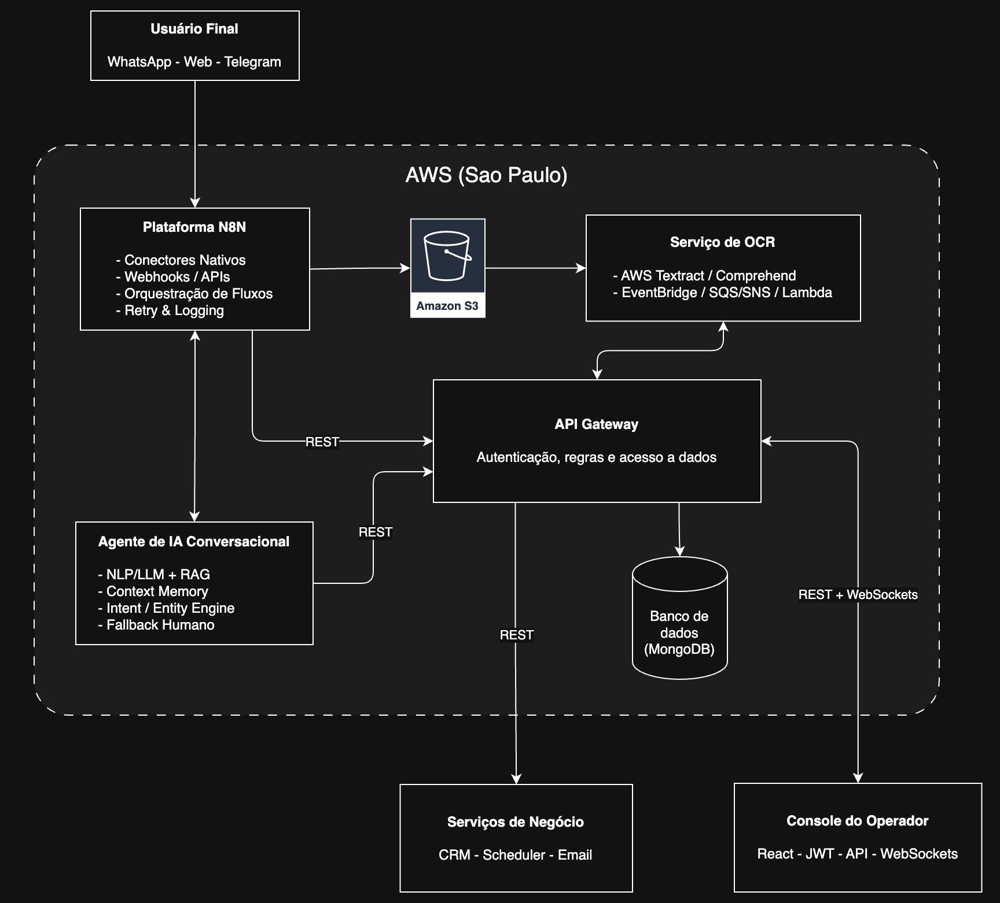

# FIAP - Faculdade de Informática e Administração Paulista

<p align="center">
<a href= "https://www.fiap.com.br/"></a>
</p>

<br>

## 👨‍🎓 Integrantes do Grupo

- `RM559800` - [Jonas Felipe dos Santos Lima](https://www.linkedin.com/in/jonas-felipe-dos-santos-lima-b2346811b/)
- `RM560173` - [Gabriel Ribeiro](https://www.linkedin.com/in/ribeirogab/)
- `RM559926` - [Marcos Trazzini](https://www.linkedin.com/in/mstrazzini/)
- `RM559645` - [Edimilson Ribeiro](https://www.linkedin.com/in/edimilson-ribeiro/)

## 👩‍🏫 Professores

### Coordenador(a)

- [André Godoi](https://www.linkedin.com/in/profandregodoi/)

## Introdução

A YOUVISA é uma empresa brasileira especializada em soluções digitais baseadas em **Inteligência Artificial, RPA e automação cognitiva** para otimizar processos consulares e de atendimento.  
O objetivo deste projeto é desenvolver uma **plataforma de atendimento multicanal inteligente**, integrando **IA conversacional, visão computacional, automação de processos (RPA), e análise de dados**, com **atendimento humano assistido** em casos complexos.

A proposta reflete uma arquitetura **modular, escalável e segura**, contemplando:
- Agente de IA conversacional omnicanal;
- Integração orquestrada por **n8n**;
- Validação de documentos via OCR e visão computacional;
- Automação RPA para formulários e notificacões;
- Painel de **atendimento humano (console do operador)**;
- Data pipeline e análise de dados preditiva;
- Governança, LGPD e observabilidade.

---

## Objetivos Estratégicos

| Dimensão | Objetivo                                                                                    |
|-----------|---------------------------------------------------------------------------------------------|
| **Cliente** | Garantir uma jornada fluida, natural e sem rupturas entre canais (WhatsApp, Web, Telegram). |
| **Operação** | Automatizar até 70 % das interações repetitivas, mantendo qualidade e contexto.             |
| **Negócio** | Reduzir custos operacionais e aumentar conversão de leads para clientes.                    |
| **Tecnologia** | Arquitetura baseada em nuvem e microserviços, extensível e observável.                      |

---

## Escopo Funcional

1. Atendimento conversacional com **NLP/LLM**.  
2. **Omnicanalidade via n8n** com contexto persistente.  
3. **OCR + visão computacional** para análise de documentos.  
4. **RPA** para automações de formulários e agendamentos.  
5. **Console de operador humano**, integrado ao fluxo.  
6. **Data Lake e dashboards analíticos**.  
7. **Camadas de segurança e LGPD**.  

---

## Arquitetura Global



---

## Componentes Principais e Motivação

### Plataforma N8N

A plataforma n8n atua como o núcleo de orquestração e integração inteligente 
dentro da arquitetura proposta. Ela conecta todos os canais de atendimento 
(WhatsApp, Webchat, Telegram) com os componentes internos da solução — o Agente 
de IA, o API Gateway, e o serviço de OCR, por meio de fluxos 
automatizados, triggers e webhooks. Assim, o n8n é o responsável por garantir 
que cada evento ou mensagem siga o fluxo correto: seja para uma automação de 
documento, uma análise de IA, ou uma interação humana no Console do Operador.

Do ponto de vista técnico, o n8n funciona como um gateway omnicanal: centraliza 
a entrada de mensagens, realiza transformações e chamadas REST para os serviços 
da AWS, além de registrar logs e políticas de retry em caso de falhas. Por ser 
low-code e extensível, ele permite que a YOUVISA evolua seus fluxos de negócio 
rapidamente, adicionando novos canais, integrações ou automações sem reescrever 
código. Cada fluxo é versionado, monitorado e audível — o que garante 
rastreabilidade, segurança e governança.

Para o cliente final, os benefícios são diretos: respostas mais rápidas, 
jornadas sem interrupções e uma experiência omnicanal fluida, onde ele pode 
iniciar um atendimento no WhatsApp e continuar no webchat sem perder o contexto. 
Para a YOUVISA, o uso do n8n reduz custos operacionais, aumenta a agilidade na 
entrega de novas funcionalidades (como a adição de novos canais, futuramente) e 
proporciona resiliência — já que o controle de filas, logs e reprocessamentos 
ocorre de forma automática, mantendo o ecossistema sempre disponível e escalável.

---

### Agente de IA Conversacional

O Agente de IA Conversacional é o coração inteligente da solução, responsável 
por interpretar a linguagem natural dos clientes e manter diálogos contínuos, 
fluidos e contextuais, independentemente do canal de origem. Ele atua como o 
primeiro ponto de contato cognitivo: compreende intenções, reconhece entidades 
e conduz o usuário em uma jornada totalmente conversacional, sem menus rígidos 
ou fluxos predefinidos. Graças à sua arquitetura modular, o agente pode 
interagir diretamente com o n8n e o API Gateway, acionando automações, consultas
ou fluxos humanos conforme a necessidade.

Tecnicamente, o agente é construído sobre uma base de NLP e LLMs (com frameworks
como LangChain ou LangGraph, integrados a modelos de linguagem hospedados em 
HuggingFace ou serviços equivalentes). Ele mantém uma memória contextual 
persistente no MongoDB, acessada via API Gateway, garantindo que o histórico e 
as preferências do usuário sejam preservados entre canais e sessões. Além disso, 
utiliza RAG (Retrieval-Augmented Generation) para enriquecer suas respostas com 
dados internos e documentos da YOUVISA, aumentando a precisão e a personalização
das interações. A camada semântica do agente permite compreender nuances de 
linguagem e responder de forma natural, adaptando-se ao tom, idioma e contexto 
de cada cliente.

O valor desse componente é duplo: para o cliente, ele proporciona uma 
experiência conversacional humanizada, reduzindo o atrito e tornando o processo 
de solicitação de vistos mais simples e rápido; para a YOUVISA, significa 
eficiência operacional e ganho de escala, com redução de até 65% no tempo médio 
de atendimento (TMA) e aumento significativo da taxa de conversão. Além disso, 
o agente evolui continuamente — os logs de conversas são usados para aprimorar 
o modelo, ajustando intents, respostas e fluxos, o que garante aprendizado 
constante e melhoria progressiva da qualidade do atendimento. 

#### RPA / Automação de Processos

**TODO: Pensar em como encaixar isso na solução**

**Função:** automação de formulários, agendamentos e comunicações.  
**Stack:** UiPath, Robocorp, scripts Python acionados via n8n.  
**Valor:** até 50 % de economia operacional, menos erros manuais, integração direta com IA e front-end.  

---

### Serviço de OCR

O serviço de OCR funciona totalmente integrado ao ecossistema da AWS, e utiliza 
o Amazon Textract para extração inteligente de texto, tabelas e formulários a 
partir de documentos enviados pelos clientes (como passaportes, comprovantes 
e formulários de visto). O fluxo inicia quando o documento é capturado pela 
plataforma n8n e armazenado no Amazon S3; a partir daí, o Textract, orquestrado
por EventBridge, Lambda e SQS, processa o arquivo de forma assíncrona, extrai 
os campos relevantes e aplica o Amazon Comprehend para análise semântica, 
detecção de PII e validação de consistência. Os resultados estruturados são 
então enviados ao API Gateway e gravados no MongoDB, onde podem ser consumidos 
pelo Agente de IA ou revisados por um humano no Console do Operador, quando 
necessário.

Essa arquitetura traz benefícios diretos ao cliente e à operação da YOUVISA: 
acelera o processo de validação documental, elimina erros manuais, garante 
conformidade com a LGPD (dados mantidos e processados exclusivamente em 
território brasileiro – AWS São Paulo) e reduz drasticamente o tempo de resposta 
em etapas críticas do processo de visto. A escolha da stack AWS — com Textract, 
Comprehend, Lambda e S3 — fundamenta-se na alta acurácia dos modelos de IA 
gerenciados, escalabilidade serverless, integração nativa com o restante da 
arquitetura e baixo custo operacional, além de fornecer rastreabilidade, 
segurança e resiliência corporativa sem exigir infraestrutura adicional.

---

### Console do Operador (Front-end Interno)

**Função:** interface única para o atendimento humano quando o chatbot transfere casos.  

**Características:**  
- Inbox unificada (WhatsApp, Web, Telegram).  
- Fila inteligente com regras por idioma, prioridade e pacote (Basic/Plus/Ultra).  
- Histórico completo da conversa e documentos.  
- Notas internas, macros, automações rápidas (via n8n).  
- Painel supervisor: QA, SLAs, NPS, tempo médio, retrabalho.  
- SSO, RBAC, logs e rastreabilidade.  

**Valor para YOUVISA:**  
- Garantia de qualidade e personalização humana.  
- Governança e métricas centralizadas.  
- Continuidade real entre IA e humano — o operador retoma o contexto completo.  

---

### Data & Analytics Platform

**Função:** consolidar logs, interações, métricas e eventos operacionais.  
**Stack:** Kafka (stream), AWS S3 (Data Lake), BigQuery/Athena (DW), Looker/Power BI (visualização).  
**Insights possíveis:**  
- Gargalos de atendimento;  
- Eficiência por canal;  
- Taxa de automação/handoff;  
- Correlação entre perfil do cliente e sucesso de visto.  

---

### Segurança e Conformidade

**Camadas de proteção:**  
- Criptografia (AES-256 / TLS 1.3).  
- IAM granular e SSO (OAuth2/SAML).  
- Logs imutáveis (WORM).  
- DLP básico para anexos.  
- Políticas LGPD: consentimento, anonimização, direito ao esquecimento.  
- Monitoramento e alertas de segurança (SIEM).  

**Valor:** garante confiança e compliance em um domínio sensível (dados consulares).  

---

## Fluxo Omnicanal Integrado (Cliente ↔ IA ↔ Humano)

```
Cliente envia msg (WhatsApp)
      │
      ▼
n8n recebe trigger → roteia para Agente IA
      │
      ▼
Agente IA interpreta intenção e contexto
      │
 ┌────┴─────────────┐
 │ Caso resolvível  │──> Executa workflow (RPA/OCR/API)
 │ pelo bot         │     ↓
 │                  │<----Retorna resultado via n8n
 └────┬─────────────┘
      │
      ▼
 Se falha ou complexidade → cria "Case" via API
      │
      ▼
 Console Operador recebe contexto completo
      │
      ▼
 Operador atua, aciona automações (via n8n),
 atualiza status → IA retoma acompanhamento.
```

---

## Plano de Implementação Sugerido

| Fase | Entregas | Duração |
|------|-----------|----------|
| **S1** | Setup Cloud + n8n + Infra base + RBAC + SSO | 4 sem |
| **S2** | MVP Agente IA (NLP/LLM) + WhatsApp + Context Store | 6 sem |
| **S3** | OCR + RPA + integrações API | 6 sem |
| **S4** | Console Operador + Handoff + QA | 6 sem |
| **S5** | Data Lake + Dashboards + Segurança final | 4 sem |
| **Total** | **26 semanas (~6,5 meses)** | |

---

## Indicadores de Sucesso

| Métrica | Antes | Depois | Variação |
|----------|--------|---------|-----------|
| Tempo médio de atendimento | 35 min | 12 min | −65 % |
| Retrabalho documental | 18 % | < 5 % | −72 % |
| Custo por lead | 100 % | 65 % | −35 % |
| Conversão para cliente | 22 % | 38 % | +16 p.p. |
| NPS médio | 70 | 90 | +20 pts |

---

## Riscos e Mitigações

| Risco | Impacto | Mitigação |
|--------|----------|-----------|
| Erro semântico do NLP | Médio | Fallback humano + retraining contínuo |
| Falha de canal (API WA/Telegram) | Alto | Failover n8n + logs automáticos |
| Vazamento de dados | Crítico | Criptografia + IAM + DLP + auditoria |
| Resistência da equipe | Médio | Treinamento e onboarding progressivo |
| Sobrecarga de fluxos | Médio | Escalabilidade cloud (EKS/Fargate) |

---

## Conclusão

A **Plataforma YOUVISA 360°** entrega uma visão completa da transformação digital no atendimento consular:  
- **Inteligência conversacional** (IA + NLP) humaniza interações.  
- **n8n** orquestra canais, fluxos e automações com agilidade.  
- **OCR e RPA** automatizam tarefas manuais e reduzem erros.  
- **Console do Operador** garante qualidade e empatia no contato humano.  
- **Data & Analytics** tornam o negócio preditivo e orientado a dados.  
- **Segurança e LGPD** preservam reputação e conformidade.

Com essa arquitetura, a YOUVISA posiciona-se como referência em **IA aplicada a serviços consulares**, oferecendo **atendimento fluido, seguro e inteligente**, do primeiro contato até a emissão do visto.

---

## Apêndice Técnico

### Modelo de Dados Simplificado

| Entidade | Campos Principais | Observações |
|-----------|-------------------|-------------|
| **Conversation** | id, canal, status, timestamps | Persistência de sessões omnicanal |
| **Message** | id, conversation_id, autor, payload, anexos | Logs auditáveis |
| **Customer** | id, PII (criptografada), preferências, idioma | Conformidade LGPD |
| **Case** | id, tipo, prioridade, fila, owner | Roteamento no console |
| **Document** | id, tipo, OCR_data, hash, validade | Ligado ao pipeline OCR |

### Endpoints REST (exemplos)

```
GET /api/v1/conversations/{id}
POST /api/v1/conversations/{id}/messages
POST /api/v1/cases
PATCH /api/v1/cases/{id}/assign
GET /api/v1/documents/{id}/validate
POST /api/v1/workflows/n8n/trigger
```

### Estrutura de Workflow n8n (exemplo)

```
Trigger (WhatsApp Message)
   ↓
Webhook → Intent Detection (IA)
   ↓
If intent == "renovar_visto":
      Execute Node (RPA DS-160)
   ↓
If OCR required:
      Upload Document → Validate OCR → Return
   ↓
Else:
      Send reply via channel
```

### Diagrama de Sequência da derivação para atendimento humano

```
Cliente (WhatsApp)         n8n             Agente IA         Orq/Rules         Console Operador
      |                     |                 |                   |                     |
1.    |---mensagem--------->|--trigger------->|                   |                     |
2.    |                     |<--intent/conf---|                   |                     |
3.    |                     |                 |---decide handoff->|                     |
4.    |                     |                 |                   |--cria Case---------->|
5.    |                     |                 |                   |--roteia p/ fila----->|
6.    |                     |                 |                   |                     |--notifica operador
7.    |                     |                 |                   |                     |   abre conversa
8.    |<--resposta (hum) via n8n/IA---------- |                   |                     |
9.    |                     |                 |<--operações via n8n (OCR/RPA/pagto)---->|
```

---


